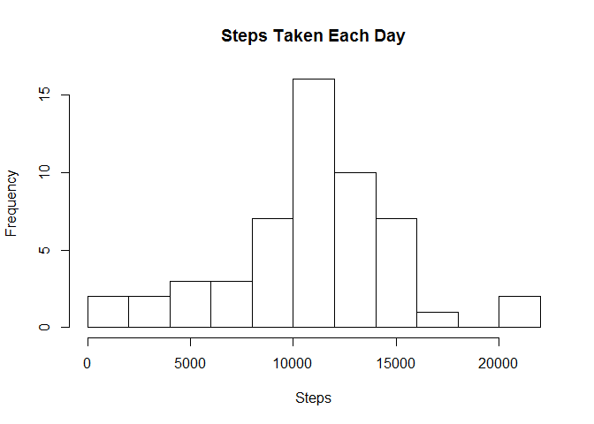
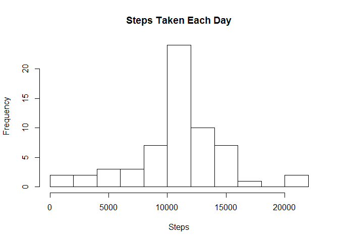

# Reproducible Research: Peer Assessment 1

## Loading and preprocessing the data
The .zip file containing the dataset was downloaded and a dataframe was extracted from it.

```r
fileUrl <- "https://d396qusza40orc.cloudfront.net/repdata%2Fdata%2Factivity.zip"
fileName <- "activity.csv"

temp <- tempfile()
setInternet2(use = TRUE)
download.file(fileUrl,temp, method = "auto",mode="wb")
data <- read.csv(unz(temp, fileName), check.names=TRUE)
unlink(temp)

data$date <- as.Date(data$date, format="%Y-%m-%d")
```

## What is the mean total number of steps taken per day?
The histogram of the dataset after removing NA's was as follows:

```r
library(dplyr)
```

```
## 
## Attaching package: 'dplyr'
## 
## The following object is masked from 'package:stats':
## 
##     filter
## 
## The following objects are masked from 'package:base':
## 
##     intersect, setdiff, setequal, union
```

```r
data1 <- data[complete.cases(data),]
perDay <- group_by(data1,date)
stepsPerDay <- summarise(perDay, steps = sum(steps))

hist(stepsPerDay$steps,main = "Steps Taken Each Day", xlab = "Steps", breaks = 10)
```

 

From the above, the mean number of steps taken each day was calculated as:

```r
mean(stepsPerDay$steps)
```

```
## [1] 10766.19
```

The median number of steps taken each day was calculated as :

```r
median(stepsPerDay$steps)
```

```
## [1] 10765
```

## What is the average daily activity pattern?
The time series plot of the 5-minute interval (x-axis) and the average number of steps taken, averaged across all days (y-axis) was as follows:

```r
library(ggplot2)
perInterval <- group_by(data1,interval)
stepsPerInterval <- summarise(perInterval, steps = mean(steps))
qplot(interval, steps,data = stepsPerInterval, geom = "path")
```

 

The 5-minute interval, on average across all the days in the dataset, that contains the maximum number of steps was calculated as follows:

```r
stepsPerInterval <- arrange(stepsPerInterval,desc(steps))
stepsPerInterval$interval[1]
```

```
## [1] 835
```

## Imputing missing values
The total number of missing values in the dataset was calculated as follows:

```r
sum(!complete.cases(data))
```

```
## [1] 2304
```

To impute the missing steps values, the average for the missing value's interval from above was used to replace each "NA" value. The resulting dataset was as follows:

```r
data2 <- data

for (i in 1:nrow(data2)) {
  
  if (is.na(data2$steps[i])) {
    data2$steps[i] <- stepsPerInterval$steps[stepsPerInterval$interval == data2$interval[i]]
  }
  
}
```

After imputing the missing values, the resulting histogram was follows: 

```r
perDay2 <- group_by(data2,date)
stepsPerDay2 <- summarise(perDay2, steps = sum(steps))

hist(stepsPerDay2$steps,main = "Steps Taken Each Day", xlab = "Steps", breaks = 10)
```

 

From the above, the mean number of steps taken each day was calculated as:

```r
mean(stepsPerDay2$steps)
```

```
## [1] 10766.19
```

The median number of steps taken each day was calculated as :

```r
median(stepsPerDay2$steps)
```

```
## [1] 10766.19
```

Between the original and imputed datasets, the difference in the means was 0 steps per day, while the difference in the medians was 1.1886792 steps per day. As such, the impact of imputing missing data using the chosen method appeared to have no effect on the mean estimate of the total daily number of steps, and a very small impact on the median estimate.

## Are there differences in activity patterns between weekdays and weekends?
A new factor variable "day" was added to the dataset to indicate if a given date was a "weekday"" or "weekend".

```r
perInterval2 <- mutate(data2, day = format(date, "%u") %in% c(1:5))
perInterval2$day <- factor(ifelse(perInterval2$day,"weekday","weekend"))
```

The time series plot of the 5-minute interval (x-axis) and the average number of steps taken  (y-axis) across weekdays and weekends was as follows:

```r
perInterval2 <- group_by(perInterval2, interval, day)
stepsPerInterval2 <- summarise(perInterval2,
  steps = mean(steps))
qplot(interval, steps, data = stepsPerInterval2, geom = "path", facets = day ~ ., xlab = "Interval", ylab = "Number of steps")
```

 

Given the above, there appears to be a difference between the average number of steps taken on weekdays and weekends.
